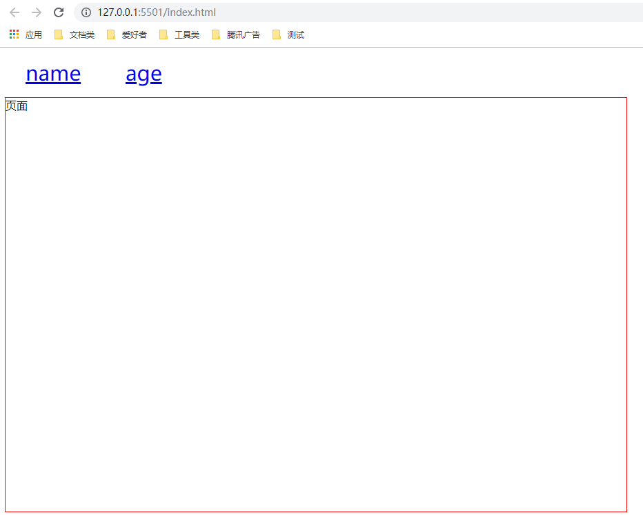
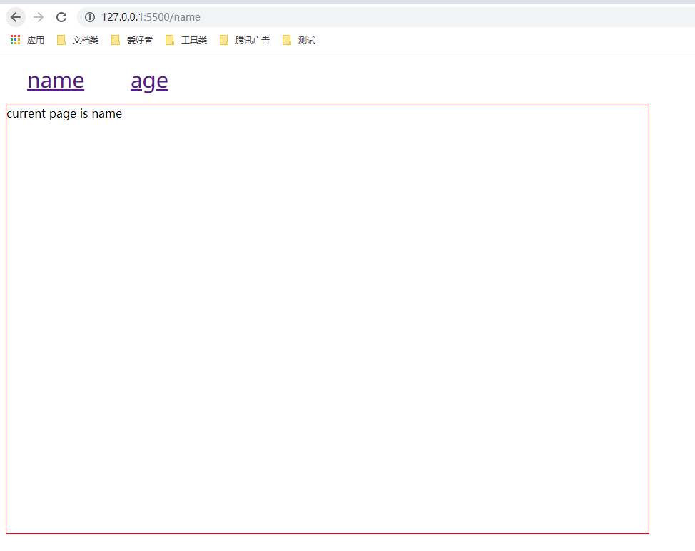
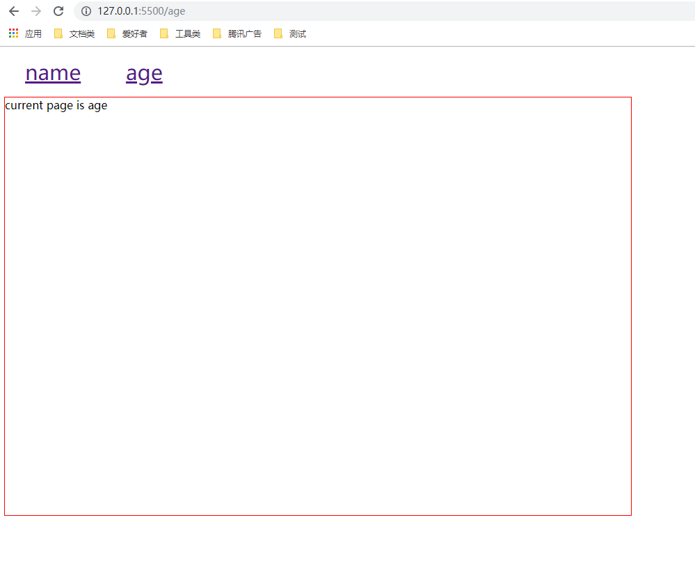

# 前端路由(history学习)

> 在HTML5中history新增加了 history.pushState和history.replaceState

## pushState() 方法

- 接收3个参数,一个是状态对象，一个是标题，和一个(可选的)得URL
- 状态对象：状态对象state是一个js对象,通过pushState()创建新的历史记录，无论什么时候什么导航到新的状态，popstate事件就会被触发，且该事件的state属性包含该历史记录条目状态对象的副本。
- 标题：目前忽略，但是将来可能会用到
- URL：定义了新的历史URL记录,调用pushState()后浏览器不会立即加载这URL，但可能会在稍后某些情况下加载这个URL，比如在用户重新打开浏览器时。新URL不必须为绝对路径。如果新URL是相对路径，那么它将被作为相对于当前URL处理。新URL必须与当前URL同源，否则 `pushState()` 会抛出一个异常。该参数是可选的，缺省为当前URL。

## replaceState()方法

> 和pushState()差不多，也是接收3个参数。pushState会增加一条新的历史记录，而replaceState则会替换当前的历史记录

##  popstate 事件

>   每当活动的历史记录项发生变化时， `popstate` 事件都会被传递给window对象。如果当前活动的历史记录项是被 `pushState` 创建的，或者是由 `replaceState` 改变的，那么 `popstate`事件的状态属性 `state` 会包含一个当前历史记录状态对象的拷贝。

####   例如

```javascript
<!DOCTYPE html>
<html lang="en">
  <head>
    <meta charset="UTF-8" />
    <meta name="viewport" content="width=device-width, initial-scale=1.0" />
    <meta http-equiv="X-UA-Compatible" content="ie=edge" />
    <title></title>
    <style>
    #router a{
        display: inline-block;
        margin: 0 30px;
        font-size: 30px;
    }
    .main{
        border: 1px solid red;
        width: 900px;
        height: 600px;
    }
    
    </style>
  </head>
  <body>
    <p id="router">
      <a href="/name" title="name">name</a>
      <a href="/age" title="age">age</a>
    </p>
    <div class="main" id="main"></div>
    <script>
      (function() {
        var router = document.getElementById("router");
        var main = document.getElementById("main");

        router.addEventListener("click", function(e) {
          e.preventDefault();
          var elm = e.target;
          var url = elm.href;
          var title = elm.title;
          history.pushState({ path: url, title: title }, null, url);
          main.innerHTML = "current page is " + title;
        });
        window.addEventListener("popstate", function(e) {
          var state = e.state;
          main.innerHTML = "当前页面为" + state.title;
        });
      })();
    </script>
  </body>
</html>

```



> 当我们点击的时候可以看到发生的变化





> 基于history API的路由，美观、好看、直观、需要对服务器进行改动以确保路径不会报错（参考资料：MDN）