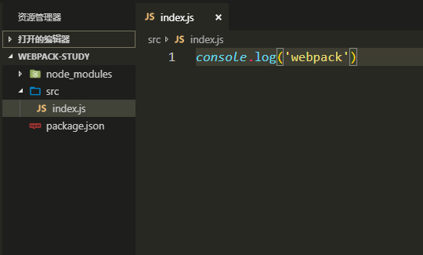
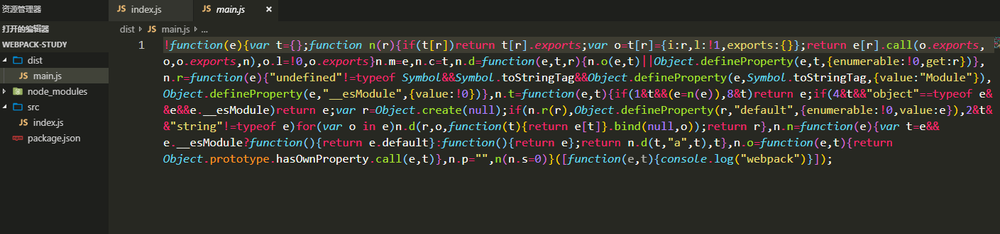
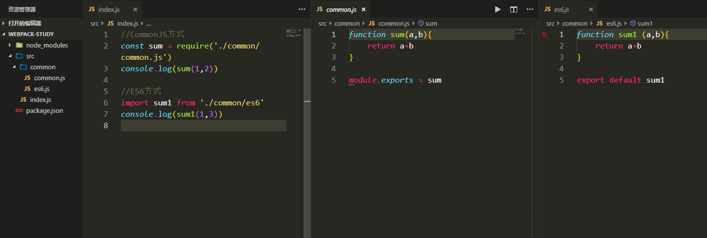
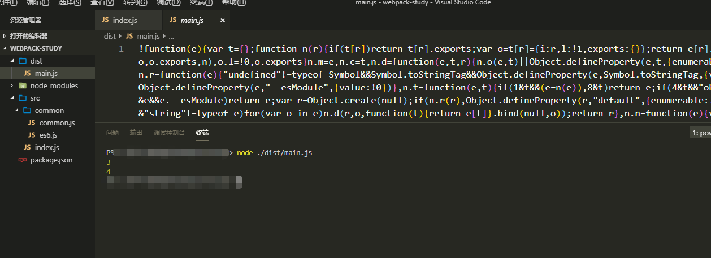

# 基本配置

## 安装

> 一般情况下我们不会全局安装 webpack，我们一般是在项目里安装 webpack，现在用到的是 *webpack4.x*，我们不仅要安装 **webpack** 还要安装一个 **webpack-cli**

```
npm install --save-dev webpack webpack-cli
```

## 真实操作

- 现在创建一个文件夹
  `mkdir webpack-study`

- 进入文件夹

  `cd webpack-study`

- 初始化配置文件 -y 是默认同意

  `npm init -y`

- 安装依赖 -D 是在开发环境中使用

  `npm install webpack webpack-cli -D`

## 输出

> 我们一般开发的时候源码是在 src 目录下，现在创建一个 src 文件夹

- 我们在 **src** 目录下新建一个 *index.js*，现在是这个样子

    

- 打包

  > 我们在当前目录下打开控制台输入`npx webpack`就可以进行打包，打包成功后默认生成一个 *dist* 文件夹，里面一个有一个 *main.js* 就是打包后的结果

    

- 模块化

  > 支持 js 的模块化，包括 CMD，AMD 和 ES6 的模块化标准

  > 现在在 src 目录下新建一个 common 文件夹

  - common.js 是 CommonJs 导出方式
  - es6.js 是 es6 的导出方式

    

- 现在执行 npx webpack 命令进行打包之后,运行 main.js 查看结果，发现可以完美运行出来

    
