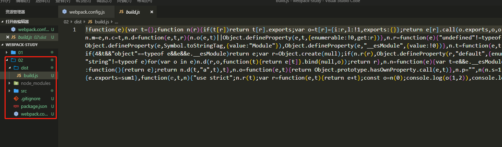

# 配置文件

> webpack默认的零配置的功能很弱,有的时候需要手动配置,默认的配置文件是webpack.config.js

- 在项目根目录新建*webpack.config.js*
- 采用*node.js*写法
- 导出一个对象
  - **入口文件**：*entry*，默认值是`./src/index.js`，可以自己指定文件
  
     - 也可以对象语法
       - 使用场景多页面和抽离公共文件的时候
  
     ```javascript
     module.exports = {
       entry: {
         index: './src/index.js',
         about: './src/about.js'
       }
     };
     ```
  
     
  
  - **出口文件**：*output*，默认值是`./dist/main.js`
    	
    	
    - **filename**：生成文件的名字
    
    	- 多个出口配置
    
    	- `[hash]`是避免缓存的随机hash值
    
    	- `[name]`是对应**entry**，打包后会生成***indexxxxx.js***，***aboutxxxxx.js***
  
    	  ```javascript
    	  module.exports = {
    	    entry: {
    	      index: './src/index.js',
    	      about: './src/about.js'
    	    },
    	    output: {
    	    	filename: '[name][hash].js',
    	    	path: path.resolve(__dirname, 'dist')
    	    }
    	  };
    	  ```
    	
    	  
    	
   - **path**：这里需要引入一个node的核心模块，需要打包后存放的地址是一个绝对路径，需要`path.resolve()`进行解析
    
  - **模式**：`mode`，告诉webpack以哪种环境运行打包，默认是*production*
    	
    	
    - ***development*** ：开发环境
    
    - **production**：生产环境
    
  
  ```javascript
  const path = require('path')
  module.exports = {
  	mode:'development',
      entry: './src/index.js',
      output: {
          filename: 'build.js',
          path: path.resolve(__dirname, 'dist')
      }
  }
  ```

> 运行 npx webpack进行打包，会生成一个dist文件夹，里面有一个build.js

