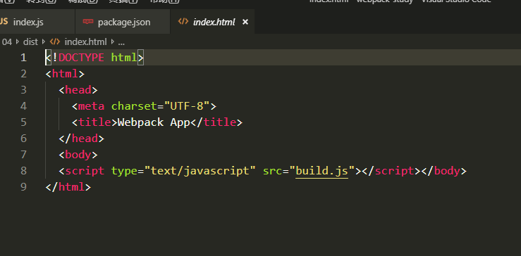
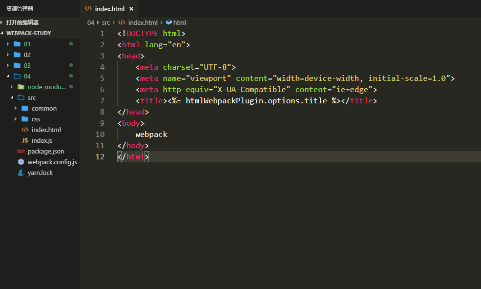
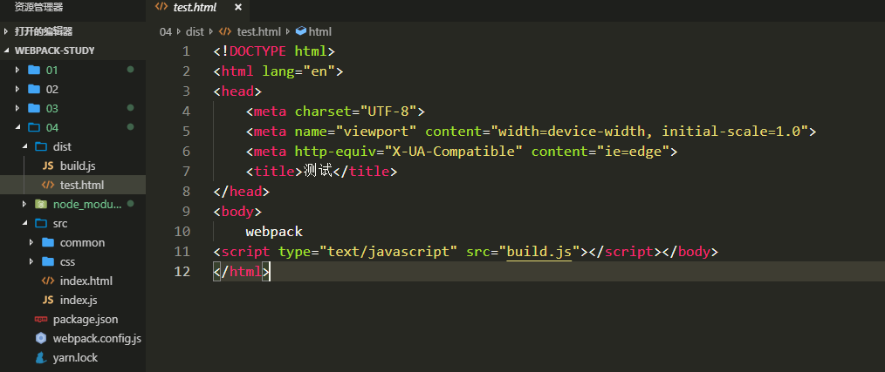

---

title: "html插件"

date: 2019-07-01

permalink: "/webpack/html插件"
meta:
  - name: description
    content: 一个热爱文学的伪程序猿，张努力，Node，webpack，JavaScript，爱好者，博客
  - name: keywords
    content: 一个热爱文学的伪程序猿，张努力，Node，webpack，JavaScript，爱好者，博客
---

# 解析html文件

## 了解插件

> 在解析打包HTML之前，先要了解webpack中的plugin

 - 想要使用插件首先要安装插件
 - 然后在webpack.config.js里面引入
 - 然后在plugins里面使用
 > **webpack.config.js**里面的*plugins*是一个数组，里面放着许多的插件

## 安装html-webpack-plugin
 - **html-webpack-plugin**插件是为应用生成一个html文件,并自动引入打包后的文件

`yarn add html-webpack-plugin -D`

## 引入和使用
```javascript
const path = require('path')
const HtmlWebpackPlugin = require('html-webpack-plugin')
module.exports = {
  mode: 'development',
  devServer: {
    contentBase: path.join(__dirname, 'dist'),
    compress: true,
    port: 3000,
    open:true,
    progress :true
  },
  entry: './src/index.js',
  output: {
    filename: 'build.js',
    path: path.resolve(__dirname, 'dist')
  },
  plugins:[
    new HtmlWebpackPlugin()
  ]
}

```

- 运行**npm run build** 会发现dist文件夹里面有一个**index.html**，并把打包后的js引入了

  

- **html-webpack-plugin**也可以传入一个对象为参数
  - **title**：生成html文件的标题
  - **filename**：生成html文件的名字，默认是index.html
  - **template**：指定生成所依赖的哪一个html文件模板，可以是html文件，ejs文件，jade文件
  - **favicon**：页面图标
  - **minfiy**：是否进行页面压缩。布尔值，默认是fasle
  - **chunks**：用于多入口文件

```javascript
  plugins:[
    new HtmlWebpackPlugin({
      title:'测试',
      minify:false,
      template:path.resolve(__dirname,'src/index.html'),
      filename:'test.html'
    })
  ]
```

- 在**src**目录下新建一个index.html



> 在控制台输入npm run build 之后发现dist目录里多了一个test.html文件



