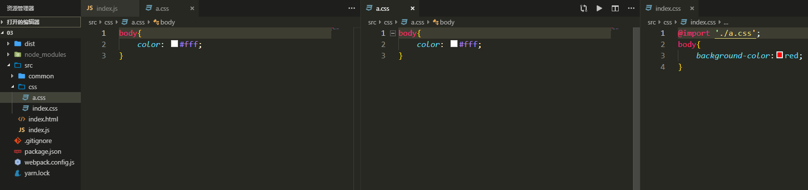

---

title: "样式处理"

date: 2019-07-03

permalink: "/webpack/解析打包样式"
meta:
  - name: description
    content: 一个热爱文学的伪程序猿，张努力，Node，webpack，JavaScript，爱好者，博客
  - name: keywords
    content: 一个热爱文学的伪程序猿，张努力，Node，webpack，JavaScript，爱好者，博客
---

# 样式处理

## 了解loader

> 在解析打包样式之前，先要了解webpack中的loader

 - loader对于模块代码的转换，可以预处理文件
 - loader有两个属性
   - test：匹配出文件，是一个正则表达式
   - use：使用哪种loader进行解析

## 安装css-loader

`yarn add css-loader -D`

- 解析`@import`和`require`语法，可以把css当做一个模块
- 继续对`webpack.config.js`进行改造，增加**module**字段
- **module**字段下有一个**rules**数组

```javascript
const path = require('path')
const HtmlWebpackPlugin = require('html-webpack-plugin')
module.exports = {
  mode: 'development',
  devServer: {
    contentBase: path.join(__dirname, 'dist'),
    compress: true,
    port: 3000,
    open: true,
    progress: true
  },
  entry: './src/index.js',
  output: {
    filename: 'build.js',
    path: path.resolve(__dirname, 'dist')
  },
  module: {
    rules: [
      {
        test: /\.css$/,
        use: ['css-loader']
      }
    ]
  },
  plugins: [
    new HtmlWebpackPlugin({
      title: '测试',
      minify: false,
      template: path.resolve(__dirname, 'src/index.html'),
      filename: 'test.html'
    })
  ]
}
```


- 在*src*目录下新建一个*css*文件夹，并在*css*文件夹内新建**index.css**和**a.css**
- 然后再*src*下**index.js**文件里引入这个**index.css**
- 在**index.css**里面引入**a.css**



- 现在可以把**a.css**和**index.css**打包在一起了，但是并不能插入到页面里面，所以还需要安装一个`style-loader`

## 安装style-loader

`yarn add css-loader -D`

- 把css插入到`<head></head>`中
- loader如果只有一个的话可以是一个字符串，如果是多个需要一个数组
- loader还可以是一个对象方式，options可以传入loader的一些配置

```
   rules: [
      {
        test: /\.css$/,
        use: [
          {
            loader: 'style-loader',
            options: {

            }
          }
        ]
      
```


- loader的顺序，从右向左执行，从下向上执行

- 现在改一下**webpack.config.js**

```javascript
module: {
    rules: [
      {
        test: /\.css$/,
        use: ['style-loader','css-loader']
      }
    ]
  },
```

> 现在打包后运行**dist**目录下的**test.html**发现**body**背景是红色的，字体是白色