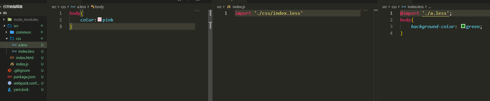

---

title: "解析预处理css文件"

date: 2019-07-07

permalink: "/webpack/解析预处理css文件"
meta:
  - name: description
    content: 一个热爱文学的伪程序猿，张努力，Node，webpack，JavaScript，爱好者，博客
  - name: keywords
    content: 一个热爱文学的伪程序猿，张努力，Node，webpack，JavaScript，爱好者，博客
---

# 解析预处理css文件

> `less`和`scss`都是差不多的流程，这里以less为例

## 安装less-loader和less

`yarn add less-loader less -D`

> **sass**的*loader* `node-sass`，`sass-loader`


- 对`webpack.config.js`进行改造
- 先解析less文件转成css文件，再把css文件插入到html标签里面

```javascript
const path = require('path')
const HtmlWebpackPlugin = require('html-webpack-plugin')
module.exports = {
  mode: 'development',
  devServer: {
    contentBase: path.join(__dirname, 'dist'),
    compress: true,
    port: 3000,
    open: true,
    progress: true
  },
  entry: './src/index.js',
  output: {
    filename: 'build.js',
    path: path.resolve(__dirname, 'dist')
  },
  module: {
    rules: [
      {
        test: /\.less$/,
        use: ['style-loader','css-loader','less-loader']
      }
    ]
  },
  plugins: [
    new HtmlWebpackPlugin({
      title: '测试',
      minify: false,
      template: path.resolve(__dirname, 'src/index.html'),
      filename: 'index.html'
    })
  ]
}
```

- 在**src/css**目录里新建一个index.less和一个a.less



> 打包之后运行index.html就可以看到变化了