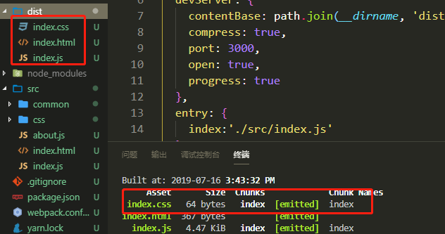

---

title: "把样式打包成文件"

date: 2019-07-11

permalink: "/webpack/把样式打包成文件"
meta:
  - name: description
    content: 一个热爱文学的伪程序猿，张努力，Node，webpack，JavaScript，爱好者，博客
  - name: keywords
    content: 一个热爱文学的伪程序猿，张努力，Node，webpack，JavaScript，爱好者，博客
---

# 把样式打包成文件

> 现在的只能把css样式插入到HTML文件中，并不能打包成一个单独的文件，现在需要用一个插件把css抽离出来，以link的方式引入

## 安装mini-css-extract-plugin插件

`yarn add mini-css-extract-plugin -D`

## 引入和使用

- 配置一下**webpack.config.js**
- 以入口和出口对象的方式写配置文件

```javascript
const path = require('path')
const HtmlWebpackPlugin = require('html-webpack-plugin')
const MiniCssExtractPlugin = require('mini-css-extract-plugin')
module.exports = {
  mode: 'development',
  devServer: {
    contentBase: path.join(__dirname, 'dist'),
    compress: true,
    port: 3000,
    open: true,
    progress: true
  },
  entry: {
    index:'./src/index.js'
  },
  output: {
    filename: '[name].js',
    path: path.resolve(__dirname, 'dist')
  },
  module: {
    rules: [
      {
        test: /\.css$/,
        use: [MiniCssExtractPlugin.loader,'css-loader']
      }
    ]
  },
  plugins: [
    new MiniCssExtractPlugin({
      filename: "[name].css",
      chunkFilename: "[id].css"
    }),
    new HtmlWebpackPlugin({
      title: '测试',
      minify: false,
      template: path.resolve(__dirname, 'src/index.html'),
      chunks:['index']
    })
  ]
}
```

- 引入`const MiniCssExtractPlugin = require('mini-css-extract-plugin')`
- 在匹配*css*文件时,增加了一个**MiniCssExtractPlugin.loader**
- 在plugin里面增加 **new MiniCssExtractPlugin**
  - **filename**：输出文件的名字`[name]`对应entry出口的名字
  - **chunkFilename**：未在entry，但有些场景需要被打包出来的文件名配置

## 打包结果



## 压缩

- 安装`optimize-css-assets-webpack-plugin`

- 使用

  ```javascript
  const path = require('path')
  const HtmlWebpackPlugin = require('html-webpack-plugin')
  const MiniCssExtractPlugin = require('mini-css-extract-plugin')
  const OptimizeCSSAssetsPlugin = require("optimize-css-assets-webpack-plugin");
  
  module.exports = {
    devServer: {
      contentBase: path.join(__dirname, 'dist'),
      compress: true,
      port: 3000,
      open: true,
      progress: true
    },
    entry: {
      index:'./src/index.js'
    },
    output: {
      filename: '[name].js',
      path: path.resolve(__dirname, 'dist')
    },
    optimization: {
      minimizer: [
        new OptimizeCSSAssetsPlugin({})
      ]
    },
    module: {
      rules: [
        {
          test: /\.css$/,
          use: [MiniCssExtractPlugin.loader,'css-loader']
        }
      ]
    },
    plugins: [
      new MiniCssExtractPlugin({
        filename: "[name].css",
        chunkFilename: "[id].css"
      }),
      new HtmlWebpackPlugin({
        title: '测试',
        minify: false,
        template: path.resolve(__dirname, 'src/index.html'),
        chunks:['index']
      })
    ]
  }
  ```

  **optimization**：优化项

## 使用postcss

- 安装postcss

  `yarn add postcss-loader -D`

- 要在解析css之前使用`postcss`，所以postcss-loader放在css-loader下面

  ```javascript
  module: {
      rules: [
        {
          test: /\.css$/,
          use: [MiniCssExtractPlugin.loader,'css-loader','postcss-loader']
        }
      ]
    },
  ```

  

- 要用postcss一些功能，要在当前项目文件目录中创建一个`postcss.config.js`

- 比如要自动添加浏览器前缀

   - 安装`autoprefixer`

   - 在postcss.config.js编写

     ```javascript
     module.exports = {
         plugins: [
             require('autoprefixer')(
                 { browsers: ['last 100 versions'] }//加上这个才会添加浏览器厂商前缀
             )
         ]
     }
     ```

- 打包出来的css就会有浏览器前缀