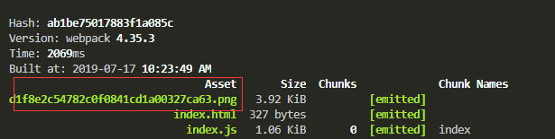

# 图片处理

- 引入图片的方式

  - 在JS动态创建img标签引入

    ```javascript
    let cImg = new Image()
    cImg.src = './img/book.png'
    document.body.append(cImg)
    
    //这样是显示不出来的,我们需要导入进来
    let cImg = new Image()
    cImg.src = require('./img/book.png')
    document.body.append(cImg)
    ```

    - 但是这样还是不行，还需要file-loader进行解析

    - 安装 `yarn add file-loader -D`

      ```javascript
      module.exports = {
        module: {
          rules: [
            {
              test: /\.(png|jpg|gif)$/,
              use: [
                {
                  loader: 'file-loader',
                  options: {},
                },
              ],
            },
          ],
        },
      };
      ```

      - 打包后就会看到有一张图片

        

  - 在css中背景图片引入

    ```css
    .div{
        width: 100px;
        height: 100px;
        background: url(../img/book.png) no-repeat center;
        background-size: cover;
    }
    ```

    - css是支持的，因为css-loader可以解析

  - 在html中以img标签引入

    - 需要安装html-loader进行解析

    - 安装 `yarn add html-loader`

    - 增加一条规则

      ```json
      {
         test:/\.html$/,
         use:'html-loader'
       },
      ```

    - 打包后就会发现img 的src图片地址发生了变化

## 小的图片打包成base64

> 有的时候，一些小的图片不想发送http请求，我们可以把图片打包成base64格式，从而减少http请求

- 安装url-loader`yarn add url-loader -D`

- 修改一下配置文件

- 把上面的file-loader修改成url-loader

  - **limit**是限制，小于多少的kb的图片换换成base64

  ```javascript 
   {
      test: /\.(png|jpg|gif)$/,
      use: [
            {
              loader: 'url-loader',
              options: {
                limit: 8192
              },
             },
           ],
    },
  ```

  

