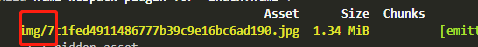

# 文件分类

> 现在打包的结果是所有的文件都在dist目录下，没有进行文件分类，想要把css放在一个文件夹下，图片放在一个文件夹下，js放在一个文件夹下

- 图片分类

  ```javascript 
   {
      test: /\.(png|jpg|gif)$/,
      use: [
            {
              loader: 'url-loader',
              options: {
                limit: 8192,
                outputPath:'img/'
              },
             },
           ],
    },
  ```

  - **outputPath**：输出，上面的是输出到img目录下

    

- css分类

  ```javascript
  plugins: [
      new MiniCssExtractPlugin({
        filename: "css/[name].css"
      })
    ]
  ```

  - 只需要在filename加上文件夹的名字就可以了

  - 但是css里面的引入背景图片的地址会发生错误，在改造一个css规则

    ```
    {
            test: /\.css$/,
            use: [
              {
              loader: MiniCssExtractPlugin.loader,
              options: {
                publicPath: '../'
              }
            }, 'css-loader', 'postcss-loader']
          },
    ```

    

- JS分类

  ```
  output: {
      filename: 'js/[name].js',
      path: path.resolve(__dirname, 'dist')
    },
  ```

  - 在filename里面加上文件夹就可以了

