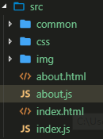

# 多应用打包


- 配置多个出口

  ```javascript
  entry: {
      index: './src/index.js',
      about:'./src/about.js'
    },
  ```

- 多个出口

  ```javascript
  output: {
      filename: 'js/[name].js',
      path: path.resolve(__dirname, 'dist')
    },
  ```

  - `[name]`代表`index`和`about`

  在`src`目录下新建一个`about.html`，`about.js`

  ​	

  

  

- 生成多个HTML文件

  ```javascript
  new HtmlWebpackPlugin({
        title: '首页',
        minify: false,
        filename:'index.html',
        template: path.resolve(__dirname, 'src/index.html'),
        chunks: ['index']
      }),
      new HtmlWebpackPlugin({
        title: '关于',
        minify: false,
        filename:'about.html',
        template: path.resolve(__dirname, 'src/about.html'),
        chunks: ['about']
      })
  ```

  - `chunks`：代表着入口文件名字，会自动引入对应的JS文件

- 生成多个CSS文件，并且相应的HTML文件引入对应的css文件

  ```javascript 
  new MiniCssExtractPlugin({
        filename: "css/[name].css",
        chunks: ['index']
      }),
      new MiniCssExtractPlugin({
        filename: "css/[name].css",
        chunks: ['about']
      }),
  ```

  - `chunks`：代表着入口文件名字，会自动引入对应的CSS文件

## clean-webpack-plugin每次打包清理dist文件夹

> 在实际开发中我们需要不断的调整代码和修改，会不断的进行打包，每次就会有新的文件产生，造成dist目录里的文件非常多，这样就需要打包前清除一个dist文件夹

- 安装`yarn add clean-webpack-plugin -D`

- 使用，放入需要清理的文件夹

  ```javascript
  const CleanWebpackPlugin = require("clean-webpack-plugin");
  
  ...
  plugins:[
      new CleanWebpackPlugin(["dist"])
  ]
  ```

  

